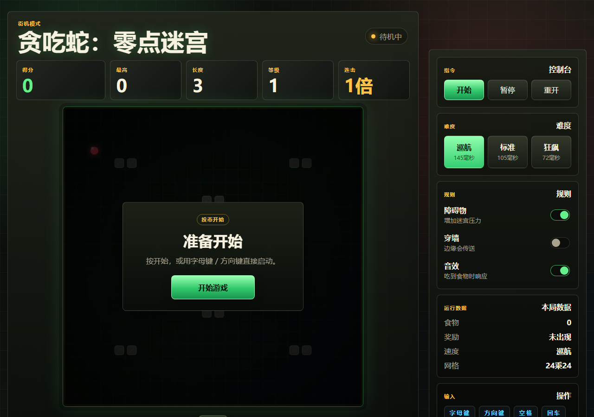

# 贪吃蛇：零点迷宫



一个使用原生 HTML、CSS 和 JavaScript 制作的街机风贪吃蛇小游戏。项目无需安装依赖，打开页面即可运行。

## 功能特点

- 街机风中文界面
- 分数、最高分、长度、等级、连击统计
- 三档难度：巡航、标准、狂飙
- 障碍物、穿墙、音效开关
- 奖励食物和得分提示
- 键盘控制和移动端触控方向键
- 本地保存最高分

## 运行方式

直接双击打开 `index.html` 即可运行。

更推荐使用本地服务器运行：

```powershell
cd "C:\Users\17146\Desktop\贪吃蛇"
python -m http.server 8000
```

然后在浏览器打开：

```text
http://127.0.0.1:8000/index.html
```

停止服务器时，在 PowerShell 窗口按 `Ctrl + C`。

## 操作说明

- 方向键 / 字母键：控制移动
- 空格：暂停或继续
- 回车：开始或重新开始
- 移动端：点击方向按钮或滑动游戏区域

## 文件结构

```text
.
├── index.html
├── styles.css
├── game.js
├── assets/
│   └── preview.png
└── README.md
```

## 更新仓库

修改代码后执行：

```powershell
git add .
git commit -m "更新说明"
git push
```
